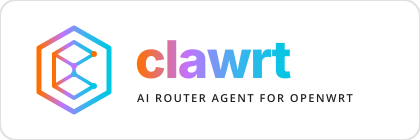

# 🎨 ClawRT Fused Brand & Visual Identity Guidelines

Welcome to the official Brand & Visual Identity Guide for **clawrt** — the open-source autonomous network automation and AI agent for OpenWrt.

---

## 🎯 1. Project Context & Brand Vibe

* **Name:** `clawrt` (always written in **lowercase** in the logotype).
* **Domain:** Open-source network automation, real-time traffic intelligence, and autonomous AI agents for OpenWrt routers.
* **Brand Vibe:** Modern, technological, abstract, minimalistic, connected, and high-performance.

---

## 📐 2. Logo Concept & Design System

The visual identity is a **Fused Concept** combining:
1. The sharp, dynamic energy of a **"claw"**.
2. The structured, parallel lines of a **digital circuit / PCB data flow**.
3. A geometric **Hexagonal "C-Circuit"** forming the primary emblem.




---

## 🎨 3. Official Fused Color Palette

Strictly utilize these color codes across all UI interfaces, documentations, web panels, and marketing assets:

| Color Role | Color Name | Hex Code | Visual Swatch | Primary Usage |
|:---|:---|:---|:---:|:---|
| **Primary** | Primary Orange | `#FF6F00` |  | Brand start point, warnings, main call-to-actions |
| **Mid Transition** | Transition Purple | `#C173FF` |  | Multi-stop gradient accent |
| **Mid Transition** | Transition Blue | `#3AB5ED` |  | Multi-stop gradient accent |
| **Secondary** | Secondary Cyan | `#00C7E2` |  | Brand end point, success states, active dots |
| **Dark Theme** | Dark Grey | `#212121` |  | Dark mode backgrounds & container cards |
| **Subtle Light** | Light Grey | `#E0E0E0` |  | Subtle borders, light mode backgrounds |
| **Pure White** | White | `#FFFFFF` |  | Clean text & light mode card backgrounds |

---

## 🌈 4. The Fused Multi-Stop Gradient

The core visual signature of **clawrt** is its continuous multi-stop linear gradient:

```css
background: linear-gradient(90deg, #FF6F00 0%, #C173FF 33%, #3AB5ED 66%, #00C7E2 100%);
```

### 💡 Application Rules:
- **Logotype & Headers:** Apply to primary logotype text or title highlights.
- **Buttons & CTA:** Use on primary action buttons (`.cbi-button-apply`, `.btn-primary`).
- **Border Accents:** Use as left-border accent strips on main UI containers (`border-left: 6px solid #FF6F00` or gradient borders).

---

## 🔤 5. Typography

- **Headers & Titles:** [`Poppins`](https://fonts.google.com/specimen/Poppins) (**Bold 700 / ExtraBold 800**). Used for structural hierarchy and logotype.
- **Body & UI Text:** [`Open Sans`](https://fonts.google.com/specimen/Open+Sans) (**Regular 400 / SemiBold 600**). Used for descriptions, documentation, and interface controls.
- **Logotype Rules:** Always write `clawrt` in **lowercase** with Poppins ExtraBold font styling.

---

## 💻 6. UI & Asset Usage Guidelines

1. **Backgrounds:** Keep UI elements clean. Use `#212121` for dark mode surfaces and `#FFFFFF` / `#E0E0E0` for light mode components.
2. **Status Indicators:**
   - **Running / Active:** `#00C7E2` (Secondary Cyan) with subtle glowing pulse.
   - **Stopped / Error:** `#FF6F00` (Primary Orange) or `#E74C3C` (System Red).
3. **Consistency:** Avoid introducing arbitrary colors outside the defined palette.
